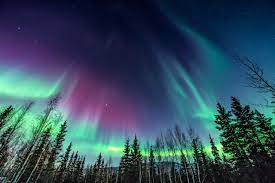

---
---

# CS 184 Final Project Proposal: The Aurora

_Nicholas Ngai, Austin Nguyen, Darren Omori, Constance Shi_

## Summary

Our goal is to develop a renderer to produce scenes depicting the auroras found near the poles of the globe. We will build upon previous assignments to simulate the physics that result in the natural phenomenon.

## Problem

The auroras are one of many visually stunning phenomena in our natural world. To be able to visit the Arctic or Antarctic and see it with our own eyes would be an incredible experience. For the time being, however, we can simulate the aurora phenomenon using a physics-based model of the aurora, using principles of ray-tracking and simulating in a rendered image how it would appear. Ideally, our rendered scenes will be indistinguishable from a photograph of the real thing. It certainly won’t be as grand, but we can provide a glimpse of the auroras for anyone who cannot go and see it themselves.

Almost every visual effect can be explained at the physical level, describing the underlying physics of energy and radiometry of optical phenomena we find interesting. Using this information, it is possible to implement a simulation to reproduce the effect in a rendered scene in a way that closely matches reality, from rainbows, to Rayleigh scattering, and much more. In this project, we will focus on the auroras, often known by their specific terms aurora borealis, which occurs near the magnetic pole in the Northern Hemisphere, and the aurora australis, which is in the Southern Hemisphere

From our preliminary research of the auroras, our implementation will involve generating a curtain that will provide the shape for the aurora borealis, implementing volumetric rendering for rays that pass through the curtain, incorporating the physics that results in the color gradients, as well as including the effects of environmental light.

## Goals

### Baseline Goals

The fundamental goal of this project is to realistically render the appearance of an aurora curtain over an outdoor scene. This involves three parts:

- **Understand the physical process.** Before we do anything else, we have to research the natural phenomena themselves to understand the physical processes that create them. This will allow us to more accurately represent the auroras, rather than blindly trying to play around with more conventional lighting effects until a render happens to resemble them. Even before deeper research, we understand that the physics behind auroras is very complex and not completely understood by modern science. The formation of the auroras, their behaviors, and knowledge about the different types of auroras that exist are all topics that are researched and discussed in the present day, and we will likely only be able to render a simplified model of the auroras.
- **Implement an algorithm to procedurally generate the auroras’ shapes.** Auroras typically appear as slowly moving shapes and curves, which is not easily modeled through mesh or implicit geometry. Preliminary research suggests that we can use principles of fluid simulation to produce the same effect by generating a 2D cross section and extruding it to produce the 3D curtain effect of the auroras.
- **Modify the renderer to accurately simulate the auroras’ appearance.** Auroras cannot simply be rendered through the use of ray-tracing and collision detection that we have studied so far in class. The current renderer is built upon a very specific perspective and understanding of light, which may not work well with the physics behind the auroras. Based on our current understanding, some form of volumetric rendering will likely have to be used to simulate the fuzzy, translucent, glowing appearance of the auroras.

Because this is not a project that involves quantifiable metrics, we will have to evaluate our performance in a qualitative fashion.  The most obvious and simple way is to holistically assess how much our rendered image resembles actual photographs of auroras.

### Stretch Goals

Time permitting, we would like to enhance the effect with some of the following goals:

- **Video simulation over time.** Auroras are dynamic phenomena, and as mentioned earlier, typically appear as slowly moving shapes and curves. Because most of the graphics concepts we have worked with so far have been fully representable by static images, our renderer is currently only capable of this type of output. While a simulated image of the auroras would be excellent in and of itself, a more complete and realistic experience of the auroras would involve a video simulation of progressively changing auroras, which ideally would capture the unique movement seen in the natural phenomena.
- **Spectral rendering.** Because auroras are formed largely through electrons moving between energy states, the auroras generally have a characteristic set of wavelengths that are emitted. The hope is that by implementing wavelength-based spectral rendering, we can more accurately model how the aurora affects the appearance of objects in the rest of the scene. This also has the side effect of allowing other wavelength-dependent effects such as splitting a beam of light into its component wavelengths.

## Schedule

### Week 1
We will familiarize ourselves with the aurora papers listed below, as well as other papers on the physics behind the aurora, and finalize our approaches for each of the parts we have choices for (such as the method to generate our footprint). We will also implement a function to generate an aurora footprint (either using splines and a fluid dynamics simulation, described in the second paper, or a sheet model of sine waves, as described in the first paper).

### Week 2
Here we will generate or finalize an auroral spectrum emission curve to implement in our project, and start implementing either volumetric photon mapping (starting with photon generation in our bounding volume hierarchies) or an electron deposition function combined with an altered raytracer.

### Week 3
In the third week, we will finish our 3D expansion of the aurora curtains based on one of the two methods described above, and colorize our aurora curves. We will also use ray tracing to cast light from the aurora onto other objects possibly existing in the scene and alter our BSDF and lighting functions accordingly.

### Week 4
Lastly, we will finalize our aurora coloration and possibly introduce functions to smooth our images to appear more natural, such as adding random amounts of noise, or using a Gaussian kernel (detailed in the first paper) to blur the aurora. We will also experiment with our renders, and produce different images and perhaps introduce different spectrum emission curves, and also explore implementing wavelength dependent light rendering to experiment with the effects it would have on our final images! We will then finalize our images and summarize our work in our write up! Then we will start looking into producing our final video and preparing for our presentation and slides.

## Resources

The first two papers provide some insight into rendering aurora both in real time and as a general overview of the approach, as well as scientific and physical background, while the last paper is a description of a rendering approach taken by students in 2014 to simulate aurora.

1. [https://citeseerx.ist.psu.edu/viewdoc/download?doi=10.1.1.125.6380&rep=rep1&type=pdf](https://citeseerx.ist.psu.edu/viewdoc/download?doi=10.1.1.125.6380&rep=rep1&type=pdf)

2. [https://dspace5.zcu.cz/bitstream/11025/1242/1/Lawlor.pdf](https://dspace5.zcu.cz/bitstream/11025/1242/1/Lawlor.pdf)

3. [https://graphics.stanford.edu/courses/cs348b-competition/cs348b-14/first_report.pdf](https://graphics.stanford.edu/courses/cs348b-competition/cs348b-14/first_report.pdf)

### Computing Platform
Our laptops - Windows, Mac and Linux, and the Hive machines

### Hardware 
Our laptops

### Software
We will build off of the code for Project 3 pathtracer, where we will modify the bsdf class, lighting functions, and bounding volume hierarchies, and possibly the ray tracer, as well as add our own classes and functions to generate the aurora.

Link: [https://github.com/cal-cs184-student/p3-1-pathtracer-sp21-tofu](https://github.com/cal-cs184-student/p3-1-pathtracer-sp21-tofu)

